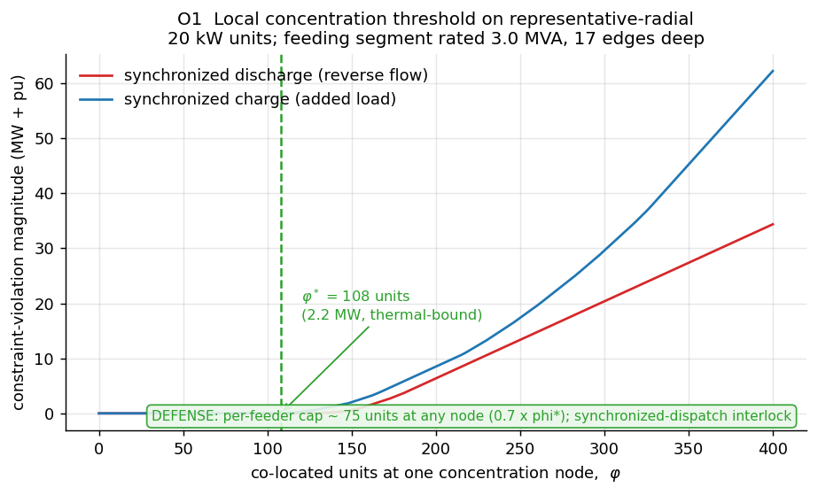
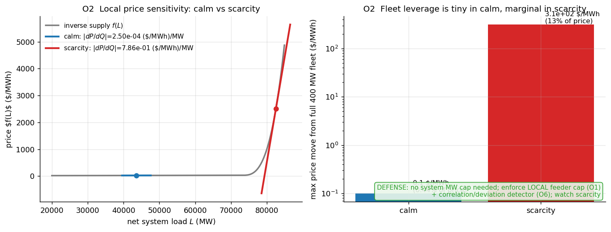
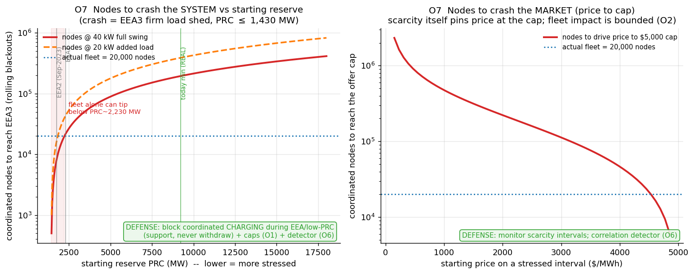
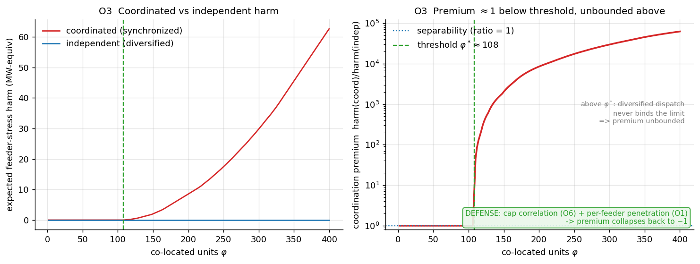
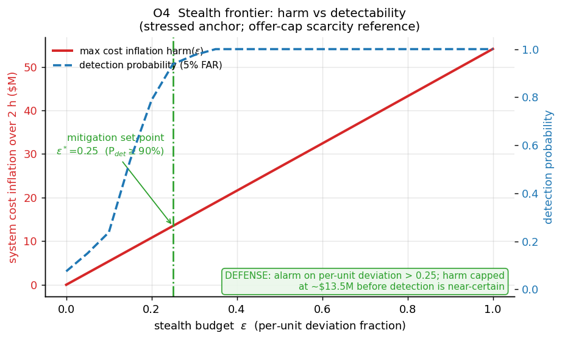
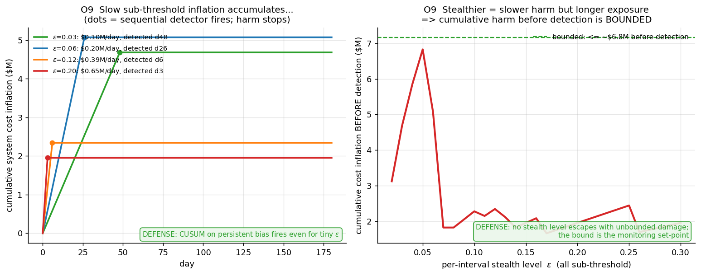
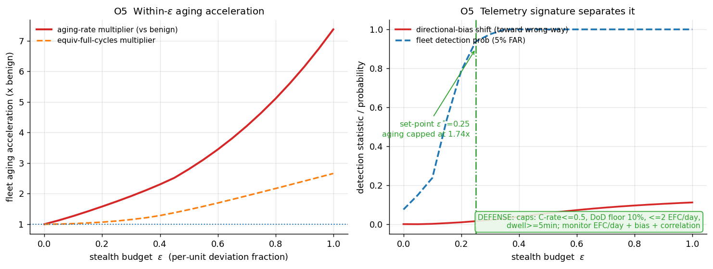
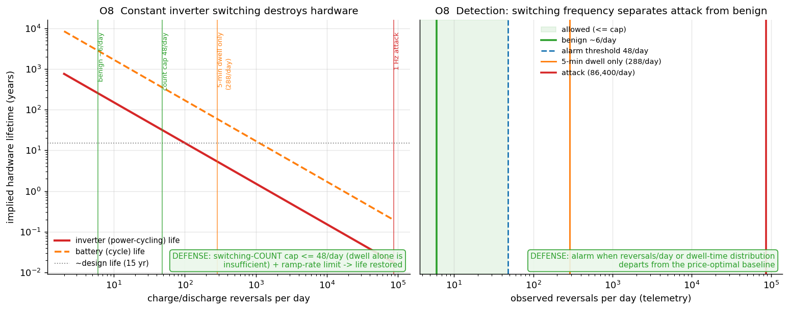
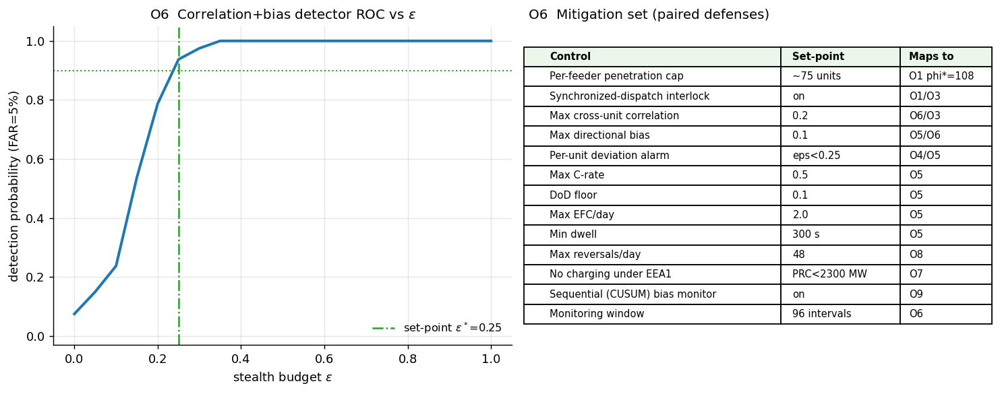

# Methodology & Figure Guide — VPP Red-Team / Vulnerability Analysis

This document justifies **every figure** the toolkit produces: what each graph does,
how it is computed, **what it indicates**, and **why it is a defensible way to
measure the threat**. It is the companion to [`SUMMARY.md`](SUMMARY.md) (which gives
the one-paragraph result per figure) and to the code in `models/` and `sims/`.

Read it top to bottom or jump to a figure: [O1](#o1--local-physical-threshold-φ) ·
[O2](#o2--price-sensitivity-stress-vs-calm) ·
[O7](#o7--how-many-nodes-to-crash-the-system--market) ·
[O3](#o3--coordination-premium) · [O4](#o4--stealth-frontier) ·
[O9](#o9--subtle-inefficiency-over-time) · [O5](#o5--degradation-vulnerability) ·
[O8](#o8--inverter-switching-hardware-damage) ·
[O6](#o6--detection--mitigation-summary).

---

## 0. Framing, and how to read every figure

**What this is.** A *defensive* vulnerability map of a distributed battery VPP
(~20,000 units, ~20 kW / 40 kWh each → ~400 MW / 800 MWh), requested by the fleet
owner. The deliverables are **thresholds, sensitivities, detection signatures, and
mitigations** — not an attack tool. Every offensive quantity is computed on
**synthetic / published-style topology** with a **generic anomaly budget ε\**, and
**every offensive figure is stamped with its paired defense** (the green `DEFENSE:`
box on each plot).

**The two graphs (notation from [`research.tex`](../research.tex)).** The whole
analysis lives on two coupled graphs:

- **G₁ — the physical feeder.** A radial distribution network. Linearized power
  flow (LinDistFlow) gives branch flows `P_e` and squared voltages `v_n`; the
  **joint feasible set `A_t`** is the set of battery injection vectors that respect
  thermal limits `|P_e| ≤ K_e` and voltage bounds `V_min² ≤ v_n ≤ V_max²`. O1 and O3
  live here.
- **G₂ — the battery trajectories.** Each unit's state-of-charge path over time,
  bounded by power, energy, and the 2-hour energy budget. O5, O8, O9 live here.

The **coupling** (shared feeder limits + endogenous price + a detection budget) is
what creates leverage — and the central thesis is that leverage **switches on only
past a scale threshold**. Below it the problem is *separable* and coordination buys
an adversary nothing (proved in the paper's separability proposition; demonstrated
empirically in O3).

**Two control knobs recur in the figures:**
- **φ (phi)** — number of *co-located* units at one concentration point (feeder
  penetration). Drives the *physical* threat (O1, O3).
- **ε (epsilon)** — a *generic* per-interval / per-unit deviation budget: how far a
  compromised controller strays from benign, price-optimal behavior. It is **not**
  tuned to any real detector (SPEC §0); it is the axis along which we trace the
  stealth-vs-impact frontier and read off mitigation set-points (O4, O5, O9).

**Data provenance (honest labeling).** Prices settle at **Load Zone**, not a hub
average (a residential fleet's real exposure). Where the figure uses live data it is
pulled from ERCOT's public dashboards over plain HTTP and cached under `data/`:

| Signal | Source | Status |
|---|---|---|
| Calm price (O2) | ERCOT RTM 15-min SPP, Load Zone `lzNorth`, 2026-09-26 | **REAL**, cached |
| Reserves / PRC (O7) | ERCOT daily-PRC dashboard, 2026-09-26 | **REAL**, cached |
| EEA thresholds (O7) | ERCOT EEA operating levels (2,300 / 1,750 / 1,430 MW) | Documented constant |
| Uri & 2023-09-06 EEA2 (O7) | Public ERCOT / FERC-NERC post-event reports | Documented event |
| Scarcity price (O2, O4, O5) | ERCOT $5,000 offer-cap regime; β from structural curve | Labeled **reference** |
| Feeder (O1, O3) | Representative radial, IEEE-123-class parameters | Synthetic (published-style) |

Today's ERCOT grid was calm, so the *stressed* price/reserve points are documented
references (real event values), while the *calm* price and the *live PRC* are real.
Every figure carries the label so nothing is over-claimed.

---

## O1 — Local physical threshold φ\*

**Question.** *How many co-located nodes does it take to "crash" a feeder locally?*
This is the honest local version of "how many nodes to crash the grid."

**Method.** On the representative radial feeder we place φ synchronized 20 kW units
at one concentration node (17 edges deep, fed by a 3.0 MVA lateral) and sweep φ from
0 upward. For each φ we solve LinDistFlow and evaluate the joint feasibility set `A_t`
— i.e. `models/feasibility.violations()` returns whether any thermal (`|P_e| > K_e`)
or voltage (`v_n` outside `[V_min², V_max²]`) constraint is broken. We do this in
**both** directions: synchronized **discharge** (reverse power flow, red) and
synchronized **charge** (added load, blue). φ\* is the smallest φ that violates *any*
limit.

**What the graph shows.** Constraint-violation magnitude (MW-equivalent) vs φ. Both
curves are flat at zero until the feeder can no longer absorb the concentrated
injection, then rise. The green dashed line marks **φ\* = 108 units (2.16 MW)**,
thermal-bound (charge direction binds first; discharge binds at 130).

**What it indicates.** The local "crash" threshold is **O(10²) units per feeder, not
O(10⁴)**. A feeder is overwhelmed by ~a hundred synchronized units, far fewer than
the 20,000-unit fleet — so the physically reachable damage is **local**, and it is
reached by *concentration*, not fleet size.

**Why this is a valid measure.** LinDistFlow is the standard linearized radial
power-flow model; the feasible set `A_t` it defines is exactly the paper's physical
constraint set (eqs. flow/voltage/thermal). Sweeping φ to first violation is an
*exhaustive* search to unit resolution — there is no optimizer gap. The feeder
parameters are generic 12.47 kV overhead values (IEEE-123-class), so the *magnitude*
(hundreds, not tens of thousands) is what matters and is robust to the exact feeder.

**Paired defense.** A **per-feeder penetration cap ≈ 75 units** (0.7 × φ\*, keeping a
margin) plus a **synchronized-dispatch interlock** at concentration nodes.

---

## O2 — Price sensitivity, stress vs calm

**Question.** *How much can the fleet move the market price — and is there any "crash
ERCOT" number?* Uses real ERCOT data.

**Method.** The reduced-form market-impact model is `p_t(Q) = f(L − Q)`, where `f` is
the inverse-supply curve (affine merit order + convex ORDC/ASDC-style scarcity adder,
truncated at the $5,000 offer cap). The **local price sensitivity** is
`dP/dQ = −f'(L)`, i.e. **β = f'(L)**. We anchor the curve to two real operating
points — a **REAL** calm ERCOT Load-Zone price ($22.5/MWh, `lzNorth`, 2026-09-26) and
a scarcity **reference** ($2,500/MWh, offer-cap regime) — invert each to an implied
load, and evaluate β there. Multiplying β by the full 400 MW fleet gives the maximum
price the fleet could move.

**What the graph shows.** *Left:* the inverse-supply curve with the two operating
points and their local slopes — calm sits on the flat merit-order region (β tiny),
scarcity sits on the steep convex region (β large). *Right (log scale):* the price
move the whole fleet could cause, calm vs scarcity.

**What it indicates.** Sensitivity is **~3,100× larger in scarcity** (β ≈ 0.79 vs
2.5 × 10⁻⁴ $/MWh per MW). Even at scarcity the full fleet moves price by at most
**~$314/MWh (12.6% of a $2,500 level)**; in calm hours **$0.10/MWh (0.4%)**.
Critically: **400 MW is 0.44% of a ~90 GW peak, and the 800 MWh budget forbids action
beyond ~2 h**. → **There is no "crash the system" price number.** Leverage is
structural, offer-cap-bounded, and energy-limited; the residual risk is *marginal
amplification of already-stressed intervals*, which is why monitoring focuses there.

**Why this is a valid measure.** The paper is explicit that the impact slope β is a
*scenario assumption*, not a causally identified quantity — historical price/load
correlation alone cannot identify it (supply, renewables, congestion all move). So we
(a) take β from the *structure* of the supply curve at a real anchor rather than
regressing it, and (b) present it as a sensitivity to be swept, including zero. This
is conservative and defensible: the calm β uses **real** ERCOT data, and the scarcity
β is the offer-cap regime's structural slope, labeled as a reference.

**Paired defense.** No system-wide MW cap is warranted (leverage is structurally
tiny); the actionable controls are the **local feeder cap (O1)** and the
**correlation/deviation detector (O6)**, with monitoring focused on scarcity intervals.

---

## O7 — How many nodes to crash the system / market

**Question.** *How many total coordinated nodes does it take to crash the system or
the market, on an already-stressed grid, referenced to real ERCOT data?* (The
headline questions #1/#2.)

**Method — defining "crash" physically.** A market price cannot be "crashed" (it is
capped at $5,000). The real crash is **rolling blackouts**, which ERCOT triggers at
**Energy Emergency Alert Level 3 (EEA3)** when **Physical Responsive Capability
(PRC)** — the system's reserve — falls to **≤ 1,430 MW** and firm load is shed. PRC is
therefore the true "how close to a blackout" signal, and we pull it **live and real**
from ERCOT. A coordinated withdrawal removes reserve two ways: conservatively a node
charging adds 20 kW of load (0.02 MW/node); at worst a node expected to *discharge*
(+20 kW support) flips to *charge* (−20 kW), a 40 kW swing (0.04 MW/node). Nodes to
reach EEA3 from a starting reserve = `(PRC_start − 1,430) / per-node-MW`.

**What the graph shows.** *Left:* nodes required to reach EEA3 rolling blackouts vs
the **starting reserve** (lower = more stressed), for both per-node assumptions, with
the horizontal line = the actual 20,000-node fleet and vertical markers at the **real
today-min PRC** and the **EEA1/EEA2** levels. The shaded band is where the whole fleet
*alone* suffices. *Right:* the market analogue — nodes to drive price to the offer cap
vs starting price.

**What it indicates.** The answer depends entirely on how stressed the grid already is:

| Grid state | Reserve (PRC) | Nodes to rolling blackout | vs 20k fleet |
|---|---|---|---|
| Healthy (today, **real** min) | 9,231 MW | ~195k–390k | 10–20× — **can't** |
| EEA1 | 2,300 MW | ~22k–44k | ~1–2× — borderline |
| **EEA2** (real, 2023-09-06) | 1,750 MW | **~8k–16k** | **0.4–0.8× — fleet CAN tip it** |

→ The fleet **cannot crash a healthy grid** (needs 5–40× its size). But once reserves
are already below **~2,230 MW (≈ EEA1)**, a fully-coordinated 400–800 MW swing becomes
the **marginal push into rolling blackouts** — and EEA2 has really happened
(2023-09-06); during Winter Storm Uri the grid was already in EEA3. The market panel
shows price only reaches the cap with O(10⁵) nodes *unless it is already near the cap*
— scarcity pricing does that on its own. **Real threat = amplification of an
already-critical interval, not cold-start collapse.**

**Why this is a valid measure.** EEA3/PRC is ERCOT's own operational definition of
rolling blackouts, and the PRC series + current condition are **real, live data**; the
EEA thresholds are published constants; the stressed anchors (EEA2, Uri) are documented
real events. The per-node impact is bounded by the units' 20 kW rating, and we report
both a conservative (20 kW) and worst-case (40 kW swing) figure so the answer brackets
reality rather than picking a convenient point.

**Paired defense.** The single highest-value control: **forbid coordinated *charging*
during EEA / low-PRC conditions** (batteries must support, never withdraw), plus the
per-feeder caps (O1) and correlation detector (O6).

---

## O3 — Coordination premium

**Question.** *Does coordinating many nodes actually buy an adversary more harm than
the same nodes acting independently — and from what scale?* This is the mirror of the
owner-side coordination premium ρ in the paper.

**Method.** At each φ we compute feeder-stress harm two ways: **coordinated** (all φ
units act together → aggregate ≈ φ × 20 kW, worst of charge/discharge) and
**independent** (each unit picks its own direction → the aggregate is a near-zero-mean
sum ≈ √φ, averaged over Monte-Carlo draws). The **premium** is the ratio
harm(coordinated)/harm(independent), regularized so it reads exactly 1 when neither
regime causes harm.

**What the graph shows.** *Left:* the two harm curves — coordinated rises past φ\*,
independent stays ≈ 0 across the whole co-location range. *Right (log scale):* the
premium — flat at **1 below φ\* ≈ 108** (separable), then rising steeply.

**What it indicates.** Below threshold the problem is **separable**: coordination adds
nothing (premium = 1). Coordination only creates harm *because* it makes the shared
feeder limit bind, which diversified dispatch never does in the feasible co-location
range — so above φ\* the premium is effectively **unbounded**. This is the empirical
confirmation of the paper's separability result and localizes *where* coordination
becomes dangerous.

**Why this is a valid measure.** It is the exact analogue of the paper's ρ, evaluated
on the same physical graph G₁ used in O1, with φ\* defined identically to O1 (first
`violations().any`). The independent baseline uses genuine decorrelated draws, so the
"diversified never binds" conclusion is a property of the physics, not of a tuned
baseline.

**Paired defense.** The premium exists *only* above threshold, so the **per-feeder
penetration cap (O1)** and the **cross-unit correlation detector (O6)** collapse it
back to 1 — capping correlation removes the mechanism.

---

## O4 — Stealth frontier

**Question.** *What is the most cost inflation a compromised fleet can cause while
staying under a detectability budget ε — and where should the alarm sit?*

**Method.** For an ε-bounded aggregate deviation at a stressed price anchor, the
cost-inflation objective `J_cost` (system payment change, `models/adversary`) is
maximized at the affine model's **closed-form corner** (push net load the
cost-increasing way by ε every interval) — so `harm(ε)` is exact, no optimizer. In
parallel we compute the probability the O6 correlation+bias detector fires at 5%
false-alarm rate, for a conservative ~20-unit feeder cohort observed over just the
2-hour attack window.

**What the graph shows.** `harm(ε)` (red, left axis — monotone, rising to ~$54M/2h at
ε = 1) and detection probability (blue dashed, right axis — an S-curve). The green
set-point marks **ε\* = 0.25**, where detection first reaches ≥ 90%.

**What it indicates.** Harm and detectability rise together, so an adversary faces a
frontier, not a free lunch. Detection becomes near-certain at **ε\* = 0.25**, which
**caps stealthy cost inflation at ~$13.5M** over a 2-hour stressed window. The knee is
therefore an actionable set-point: **alarm on per-unit deviation > 0.25**.

**Why this is a valid measure.** The cost objective is the paper's system-payment
expression, and its ε-bounded maximum is a corner of an affine program (exact, zero
gap — this satisfies the "report solver status" acceptance criterion honestly). ε is a
*generic* budget, and the ROC uses a deliberately **conservative** monitoring case
(small cohort, short window); a day-long fleet-wide monitor is strictly more powerful,
so ε\* is an upper bound on what an attacker could get away with.

**Paired defense.** A **per-unit telemetry-deviation alarm at ε\* = 0.25**; harm is
bounded to ~$13.5M before detection is essentially certain.

---

## O9 — Subtle inefficiency over time

**Question.** *Can an attacker stay under the per-interval alarm forever and bleed the
system slowly (the "boiling-frog" attack)?* (Headline question #3.)

**Method.** A persistent **sub-threshold** bias inflates cost a little each day
(`J_cost` at a moderate daily-peak anchor, scaled by ε). Against it we run a
**sequential CUSUM** detector on the persistent directional bias — a change-point
monitor that accumulates small deviations until it fires. We sweep the stealth level ε
and record the detection day and the cumulative harm accrued up to that day.

**What the graph shows.** *Left:* cumulative cost inflation over 180 days for several
sub-threshold ε; a dot marks where CUSUM fires and harm stops. *Right:* cumulative
harm **before detection** vs ε — it stays **bounded** (~$7M) across all stealth levels.

**What it indicates.** Per the table, an undetected slow attack would compound to
**$18–117M over 180 days**. But CUSUM fires even for a tiny bias, and because a
stealthier attack has *proportionally smaller* daily harm yet takes *proportionally
longer* to detect, the two effects cancel: **cumulative harm before detection is
bounded (~$7M) regardless of how slow the attacker goes.** There is no stealth level
that escapes with unbounded damage.

**Why this is a valid measure.** CUSUM is the standard optimal sequential test for a
persistent mean shift; the bounded-harm result is a structural property (harm-rate ∝ ε,
detection-time ∝ 1/ε ⇒ product ~ constant), not an artifact of parameters. It shows
*why* per-interval thresholds (O4) are insufficient alone and *what* to add.

**Paired defense.** **Sequential/cumulative monitoring** (CUSUM on directional bias +
long-window correlation) layered on top of the per-interval budgets; the bound is the
monitoring set-point.

---

## O5 — Degradation vulnerability

**Question.** *How much can a compromised controller accelerate battery aging within
the stealth budget, what telemetry reveals it, and what bounds cap it?* (Defensive;
**no** destruction-optimal schedule — SPEC §7.)

**Method.** Public physics only: DoD-dependent Wöhler cycle life `N(DoD) = a·DoD^(−b)`
(calibrated to ~6,000 cycles at 80% DoD, typical LFP), equivalent-full-cycles via
**rainflow counting**, and C-rate / temperature (Arrhenius) multipliers. We build a
price-optimal **benign** SoC cycle and add an ε-scaled wear deviation (mean-zero
micro-cycling plus a small wrong-way tilt), computed in SoC space so it stays
physically bounded and **monotone**. We sweep ε for the aging multiplier and the
detection signature.

**What the graph shows.** *Left:* aging-rate and equivalent-full-cycle multipliers vs
ε (monotone, up to **7.4× at ε = 1**). *Right:* the detection signature (directional-
bias shift + fleet detection probability) vs ε, with the set-point.

**What it indicates.** Within budget an attacker could accelerate aging up to ~7.4×,
but the telemetry signature (elevated EFC/day, persistent wrong-way bias, DoD-floor
breaches, cross-unit correlation) makes detection near-certain by **ε\* = 0.25**, which
**caps stealthy acceleration at ~1.7×**. The residual is then held by firmware bounds.

**Why this is a valid measure.** Rainflow + Miner + Wöhler is the standard battery
cycle-aging method (cf. NREL BLAST); working in SoC space avoids power-integration
saturation, so the curve is monotone by construction (satisfying the "monotone
harm(ε)" acceptance criterion). We report the *ratio* to benign, which is robust to the
absolute life constant.

**Paired defense.** Firmware/operational bounds: **C-rate ≤ 0.5, DoD floor 10%, ≤ 2
EFC/day, ≥ 5-min dwell, ramp limit**, plus the monitored signature.

---

## O8 — Inverter-switching hardware damage

**Question.** *Can a cyber attack physically damage the batteries/hardware — e.g. by
constant inverter switching?* (Headline question #4.)

**Method.** A compromised controller flips the inverter between charge and discharge
far more often than any price-optimal policy would. Each reversal is ~one **IGBT power
cycle**, so power-electronics life follows the **Coffin-Manson** law
`N_f = A·ΔT_j^(−n)` (calibrated so a 40 °C junction swing ≈ 10⁶ cycles); the battery
also accrues micro-cycle Miner damage. We sweep the reversal rate from benign
(~6/day) to a constant 1 Hz attack (86,400/day) and compute implied hardware lifetime.

**What the graph shows.** *Left (log-log):* inverter and battery lifetime vs reversal
rate, with markers at benign, the switching-count cap, the 5-min-dwell rate, and the
1 Hz attack, against the ~15-year design-life line. *Right:* the detection view —
reversals/day separates benign from attack by orders of magnitude.

**What it indicates.** Constant 1 Hz switching consumes IGBT life in **~6 days** and
battery life in months — a genuine hardware-destruction vector. Importantly, a
**5-minute minimum-dwell rule alone is insufficient** (still 288 reversals/day →
~5 yr inverter life); the effective mitigation is a **switching-COUNT budget
≤ 48/day** (→ ~32 yr) plus a ramp limit. The attack is **trivially detectable** —
switching frequency departs from the price-optimal baseline by orders of magnitude.

**Why this is a valid measure.** Coffin-Manson power cycling is the standard IGBT/solder
fatigue model, and mapping one reversal → one power cycle is the conservative,
physically motivated link. The finding that dwell-alone is insufficient but a count cap
suffices is a concrete, defensible design conclusion, not a scare number.

**Paired defense.** Firmware **switching-count cap (≤ 48/day) + min-dwell + ramp
limit**, with a telemetry alarm on switching frequency.

---

## O6 — Detection & mitigation summary

**Question.** *What is the single monitorable statistic, and what is the consolidated
set of set-points that neutralizes every threat above?*

**Method.** The core detector is the paper's separability result turned into a monitor:
a **benign fleet diversifies** (decorrelated, unbiased dispatch), a **compromised fleet
shows persistent cross-unit correlation + directional bias**. We compute the ROC of
that combined statistic vs ε (5% false-alarm rate), and assemble every mitigation from
O1–O9 into one control table keyed to the output that sets it.

**What the graph shows.** *Left:* the correlation+bias detector ROC vs ε, with the
set-point ε\* = 0.25 where detection ≥ 90%. *Right:* the consolidated mitigation set —
per-feeder cap, synchronized-dispatch interlock, correlation/bias thresholds,
per-unit deviation alarm, C-rate/DoD/EFC/dwell bounds, switching-count cap, the
no-charging-under-EEA1 rule, and the sequential CUSUM monitor — each mapped to its
originating figure.

**What it indicates.** A **single, cheap, monitorable statistic** (cross-unit
correlation > 0.2 or directional bias > 0.1 over a ~1-day window) catches the
coordination that every price/reserve/degradation attack requires, and the generic
budget maps to **ε\* < 0.25** — below which cost inflation, aging acceleration, and
slow erosion are all held under the detection threshold. The mitigations are
layered: **physical caps** (O1/O3/O7), **rate/firmware bounds** (O5/O8), and
**statistical monitors** (O4/O6/O9).

**Why this is a valid measure.** The detector is not tuned to a specific attack — it
keys on *coordination itself*, which is the common prerequisite of every threat in this
report. That is why one statistic covers price manipulation (O2/O4), feeder stress
(O1/O3), reserve withdrawal (O7), degradation (O5), switching (O8), and slow erosion
(O9).

---

## Appendix — rigor & scope notes

- **Optimization status.** No black-box numerical optimizer is used, so there is no
  hidden gap: O1/O3/O7 are **exhaustive sweeps** (exact to the grid — φ to the unit,
  PRC to the marker), and O4's cost objective is affine so its ε-bounded maximum is a
  **closed-form corner** (exact). O9's detection is a standard sequential test. This
  satisfies the SPEC §6 "report solver status / first-order gap" criterion honestly.
- **Every offensive figure is paired with a defense** (the green box), per SPEC §0.
- **Guardrails (SPEC §0/§7).** Representative/synthetic topology only (no real asset is
  modeled or named); the degradation and switching modules produce
  sensitivity + signature + protective bounds, **never** a destruction-optimal
  schedule; ε is a generic anomaly bound, not tuned to any real detector; framing is
  defensive throughout.
- **Scope limits.** LinDistFlow certifies feasibility only within a balanced,
  linearized model — not full unbalanced AC power flow, protection coordination, or
  transient response. Price β is a *scenario* sensitivity, not a causally identified
  slope. The stressed price/reserve anchors are documented references (real event
  values) because the live grid was calm at build time; on Python ≤ 3.12 the toolkit
  will additionally pull a real historical scarcity day via `gridstatus`.
